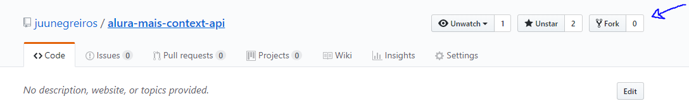

# Gerenciando o estado da sua aplicação React com Context API

Esse é o repositório inicial para o vídeo sobre Context API disponível no [Alura+](https://cursos.alura.com.br/alura-mais).

## Baixando o projeto

### Tenho usuário no github e git instalado!

Se você já tiver github, você pode forkar esse projeto para que ele fique salvo no seu perfil :)

Clique em fork


Depois, dentro do repositório no seu perfil, clique em clone e copie o link


Depois navegue pela linha de comando até a pasta onde salva os seus projetos e clone o seu projeto:

```
  git clone link-que-voce-copiou
```

Depois que o repositório estiver baixado, entre na pasta que foi clonada:

```
  cd alura-mais-context-api
```

### Não tenho e/ou não quero usar o github

Você pode clicar em `clone or download` e depois em `Download zip`


Depois é só extrair o zip e navegar pela linha de comando até a pasta que você baixou

## Instalação

Dentro da pasta, faça a instalação do projeto:

```
  npm install
```

E, por fim, rode o projeto:

```
  npm start
```

## Outras considerações

Esse projeto foi criado através do [Create React App](https://github.com/facebook/create-react-app) e nenhuma biblioteca adicional foi instalada.

Se quiser saber mais sobre a ferramenta, recomendo ler o [material disponível na documentação do React](https://pt-br.reactjs.org/docs/context.html).

Quaisquer dúvidas, críticas ou comentários estou à disposição!
